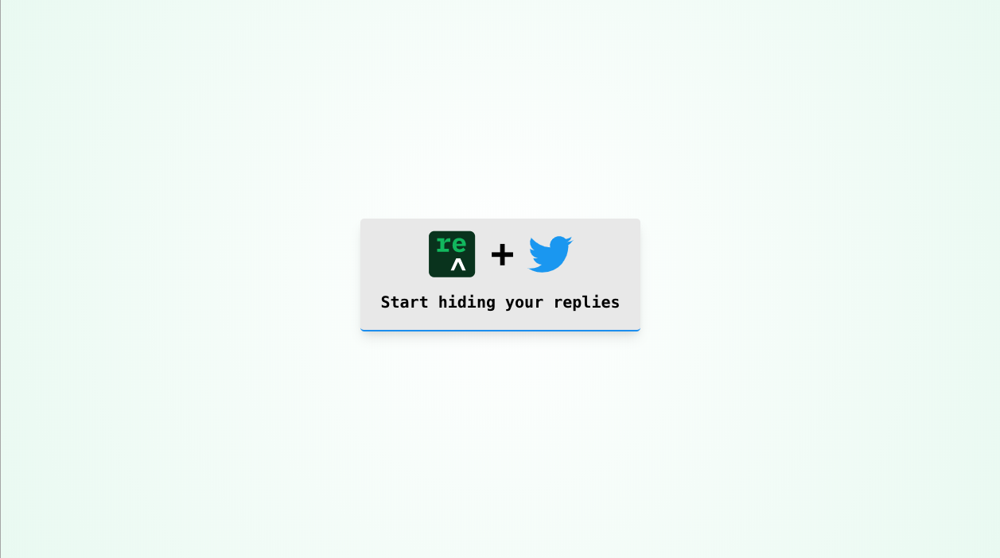

# We have terminated the backend for this project.  Old Reshuffle projects can no longer be deployed.

[](https://circleci.com/gh/reshufflehq/blank)

This is a [Reshuffle](https://reshuffle.com/) template. It handles the twitter 3-leg OAuth process and allows users to hide replies
to potentially toxic tweets. By default, replies will be automatically flagged by the backend (if they include the word
"toxic"). To hide a reply, the user must explicitly click the
"Hide" button.




### Requirements

You will need a Twitter development account and access to
Twitter labs. Use the credentials you obtain from those processes
to fill in the `.env` file for your app.

.env

```yml
TWITTER_CONSUMER_KEY=
TWITTER_CONSUMER_SECRET=
TWITTER_ACCESS_TOKEN=
TWITTER_ACCESS_TOKEN_SECRET=
TWITTER_ENV=
COOKIE_SIGNING_SECRET=
```
